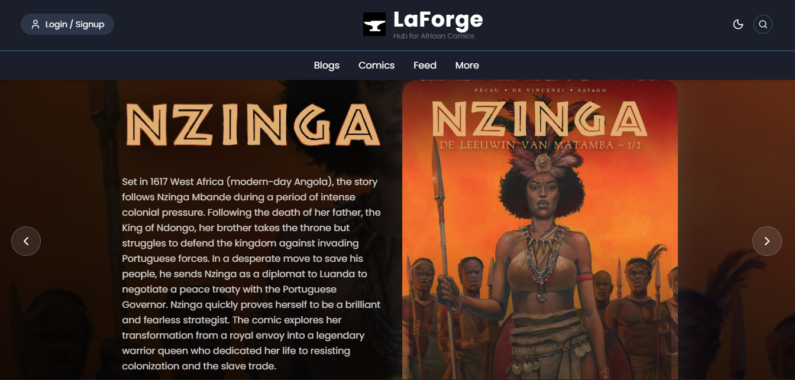
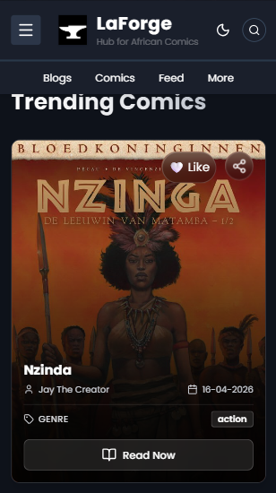
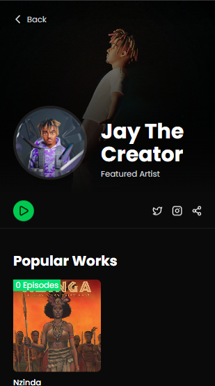
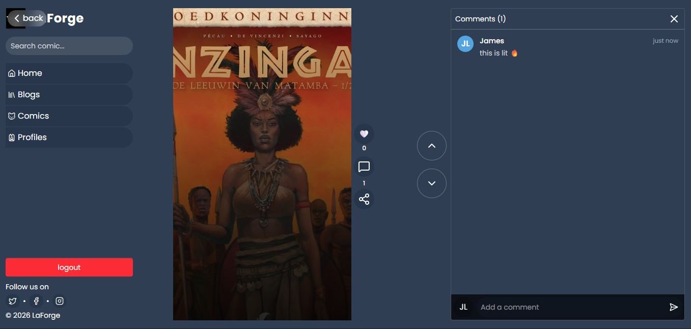

I checked your repo: LaforgeComics

Here’s a **professional, MLH Fellowship–ready README** you can copy and paste 👇

---

# 📚 LaforgeComics

A modern web-based platform for discovering, reading, and managing comics, built with a focus on performance, scalability, and user experience.

---

## 🚀 Overview

LaforgeComics is a full-stack web application designed to provide users with an engaging and seamless comic reading experience. The platform allows users to explore comic collections, view detailed content, and interact with a clean and intuitive interface.

This project demonstrates strong proficiency in modern web development practices, including frontend architecture, backend integration, and scalable application design.

---

## ✨ Features

* 📖 Browse and explore comics
* 🔍 Search and filter functionality
* 🖼️ Rich media display (images & comic panels)
* ⚡ Fast and responsive UI
* 🧩 Modular and scalable architecture
* 🔐 Backend-ready structure for authentication & data handling

---

## 🛠️ Tech Stack

### Frontend

* React
* TypeScript
* Tailwind CSS (or your styling system)

### Backend

* Node.js
* Express.js

### Database

* MongoDB (or your preferred database)

### Other Tools

* Git & GitHub
* REST APIs

---

## 📂 Project Structure

```
LaforgeComics/
│── client/        # Frontend (React + TypeScript)
│── server/        # Backend (Node.js + Express)
│── assets/        # Static files (images, etc.)
│── README.md
```

---

## ⚙️ Installation & Setup

### 1. Clone the repository

```bash
git clone https://github.com/Glocks99/LaforgeComics.git
cd LaforgeComics
```

### 2. Install dependencies

#### Frontend

```bash
cd client
npm install
```

#### Backend

```bash
cd server
npm install
```

### 3. Run the project

#### Start backend

```bash
cd server
npm run dev
```

#### Start frontend

```bash
cd client
npm run dev
```

---

## 🧠 Design Decisions

* **Component-based architecture** ensures reusability and maintainability
* **Separation of concerns** between frontend and backend
* **Scalable backend structure** for future features like authentication and payments
* **API-driven development** for flexibility and integration

---

## 📈 Future Improvements

* 🔐 User authentication (JWT / OAuth)
* ❤️ Favorites and bookmarking system
* 💬 Comments and user interaction
* 📊 Admin dashboard for content management
* ☁️ Cloud deployment (AWS / Vercel / Docker)

---

## 🤝 Contributing

Contributions are welcome!
Feel free to fork the repository and submit a pull request.

---

## 📄 License

This project is licensed under the MIT License.

---

## 👨‍💻 Author

**James Larbie**

* IT Student @ Ghana Telecom University
* Backend-focused developer
* Interested in cloud computing and scalable systems

---

## 🌟 Why This Project?

This project was built to showcase:

* Full-stack development skills
* Clean and scalable architecture
* Real-world problem solving
* Make African comic creators heard and projected more

---

## 🔗 Live Demo

`https://laforge-comics.vercel.app/`


  

---
